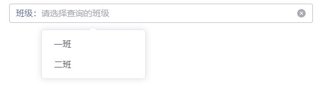
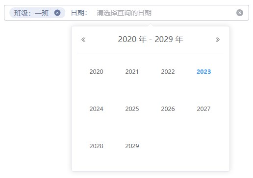
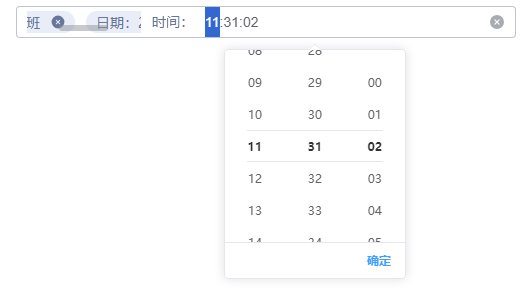
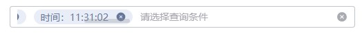

# 搜索

## 属性

| 属性名 | 说明 | 类型 | 默认/可选值 | 必填 |
|:--------|:---------:|:---------:|:---------:|--------:|
| v-model | 绑定值 |`object`| - | 否 |
| list | 搜索条件，详细见下表 | `Array` | `[]` | 是 |
| type | 展示类型 |`string`|`option`（默认） 、`expand` | 否 |

### list 详细

| 属性名 | 说明 | 类型 | 默认/可选值 | 必填 |
|:--------|:---------:|:---------:|:---------:|--------:|
| label | 查询条件名 | `string` | - | 是 |
| key | 条件对应字段，不可重复 |`string`| - | 是 |
| show | 是否在可选条件列表内显示 |`boolean`| true | 否 |
| type | 选项值类型 |`string`| `time`, `timerange`, `date`, `daterange`, `month`, `monthrange`, `week`, `year`, `select` | 否 |

### 关于选项值为 select 说明

1. 选项值目标为下拉选项，可通过`list.type = 'select'`进行配置，也可通过直接设置`list.list`到同样效果，并且`list.list`数组长度不能为空

2. `list.list`可通过`list.listProps`指定`list.list`的`label`和`value`，若不指定，

  - `label`默认取`label > name > title`；

  - `value`默认取`value > id > key > uuid > code`

### 示例 

```js
[
  {
    label:'名称',
    key:'name',
  },{
    label:'班级',
    key:'class',
    // listProps:{
    //   label:'label',
    //   value:'value'
    // }
    // type: 'select', // 此处type可以不写，自动识别为 select 
    list: [
      {
        label: '一班',
        value: 1
      },
      {
        label: '二班',
        value: 2
      }
    ]
  },{
    label:'年份',
    key:'year',
    type:'year'
  }
]
```

## 事件

| 事件名 | 说明 | Type |
|:--------|:---------:|--------:|
| change | 选中值发生变化时触发 | `(value: {key:string}) => void` | 

## 部分效果展示





