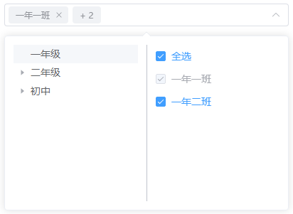

# 树形拆分选择器

## 属性

| 属性名 | 说明 | 类型 | 默认值 | 必填 |
|:--------|:---------:|:---------:|:---------:|--------:|
| v-model | 绑定值 | `Array`/`string`/`number` | - | 是 |
| data | 树形结构数据 | `Array` | `[]` | 是 |
| disabled | 禁用 | `boolean` | `false` | 否 |
| multiple | 支持多选 | `boolean` | `false` | 否 |
| clearable | 支持清空 | `boolean` | `false` | 否 |
| placeholder | 输入框占位文本 | `string` | `请输入` | 否 |
| treeProps | 树形列表配置选项，详细见下表 | `object` | - | 否 |
| listProps | 选项列表配置选项，详细见下表 | `object` | - | 否 |

### treeProps 详细

| 属性名 | 说明 | 类型 | 默认值 | 必填 |
|:--------|:---------:|:---------:|:---------:|--------:|
| label | 指定节点标签为节点对象的某个属性值 | `string` | `label` | 否 |
| list | 指定树节点对应选项列表字段 | `string` | `list` | 否 |
| children | 指定子树为节点对象的某个属性值 | `string` | `children` | 否 |

### listProps 详细

| 属性名 | 说明 | 类型 | 默认值 | 必填 |
|:--------|:---------:|:---------:|:---------:|--------:|
| label | 指定节点标签为节点对象的某个属性值 | `string` | `label` | 否 |
| value | 指定选项列表选定值 | `string` | `value` | 否 |
| disabled | 指定选项列表是否可选 | `string` | `disabled` | 否 |

## 事件

| 事件名 | 说明 | Type |
|:--------|:---------:|--------:|
| change | 选中值发生变化时触发 | `(value: any) => void` | 
| show | 显示时触发 | - | 
| hide | 隐藏时触发 | - | 

## 效果展示

## 待开发功能 

1. 自定义选项列表

2. 显示自动展开选中树节点